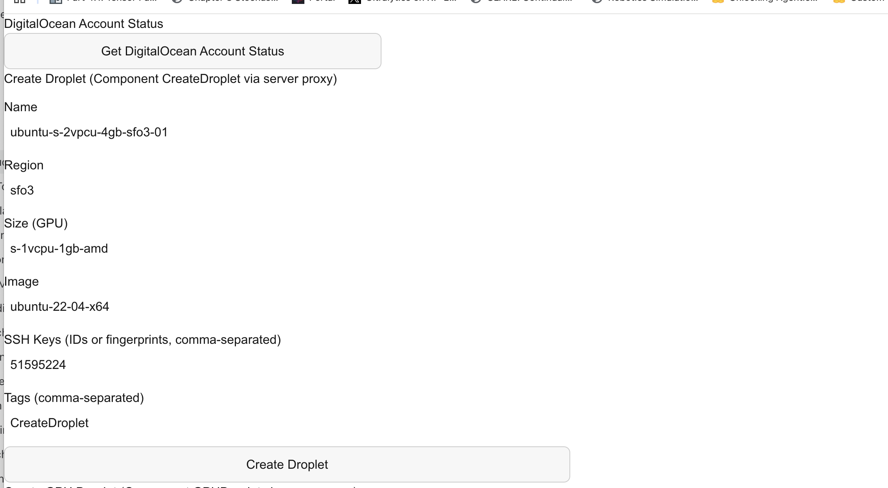
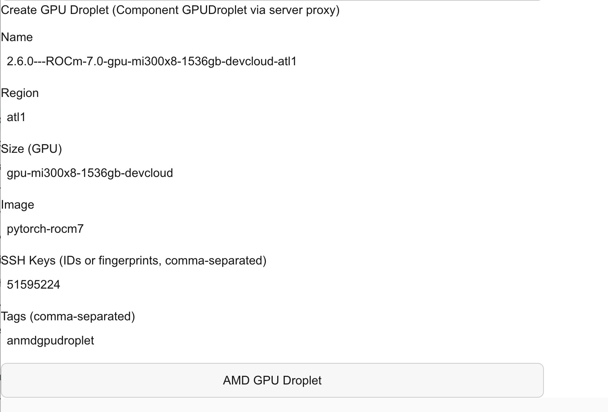
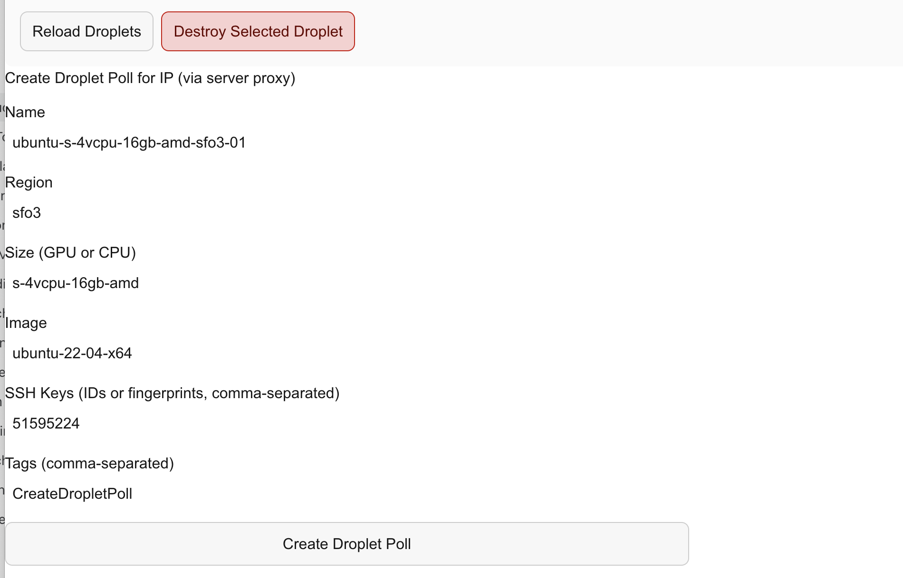
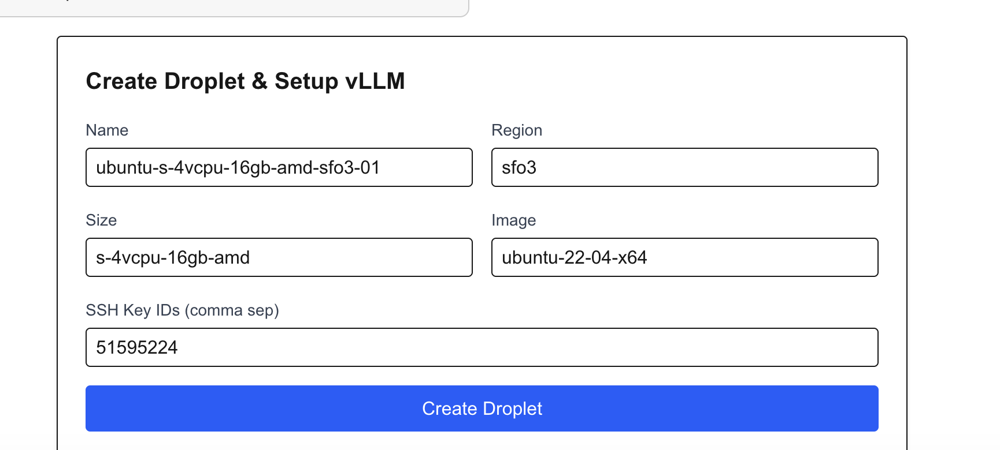

AMD proposal

The Proposal document is in overleaf. Login to Overleaf to modify and download pdf
2/4: Running Mujoco Ant and Hopper. Building sw for parameter sweeps on colab terminal

1) Exploring large data set generation for browser agents. The distributed computing skills are important since this applies to all webscale discussions. Can we do distillation without large cost burdens on LLM calls? How to measure the efficiency of distillation? Brute force never a good idea. 
2) Exploring Imitation learning strategies to train agents for gpubrowser leaderboard. Behavior cloning and the standard progression to DAgger, GAIL, Inverse RL are ok but there may be more to be gained by using the browser trail. How to model the current or recent rollout history? 
3) Exploring IL strategies for multi task agent applications. 

## DigitalOcean provisioning workflow

The DigitalOcean UI supports the infrastructure workflow used for remote AMD
experiments:

- Check DigitalOcean account status before provisioning.
- Create standard CPU droplets through the server proxy.
- Create AMD GPU droplets, including MI300X configurations with ROCm images.
- Reload or destroy droplets and poll newly created droplets for their assigned
  IP addresses.
- Create a droplet and continue directly into the vLLM setup workflow.

| Account status and standard droplet | AMD GPU droplet |
| --- | --- |
|  |  |

| Droplet management and IP polling | Droplet creation and vLLM setup |
| --- | --- |
|  |  |
